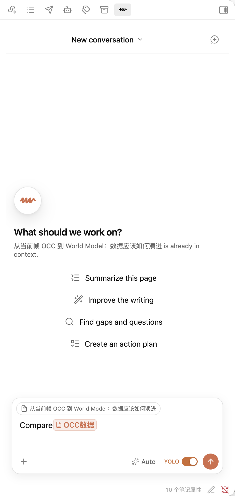

# Windy

> A page-native agent for Obsidian.

Windy is an experimental Obsidian agent that treats the page—not the chat tab—as the primary unit of work.

Open a note and the agent follows it. Reopen the agent and the most relevant conversation for that page returns. Mention other notes when needed, while the current page remains the stable primary context.

## Why Windy

Most Obsidian agent plugins are chat-centric:

- the agent lives in a persistent sidebar;
- conversations are organized as tabs;
- switching notes does not switch the active conversation;
- users must manually keep note navigation and chat navigation in sync.

This creates friction precisely where an embedded agent should feel effortless.

Windy starts from a different interaction model:

> The page is the workspace. The agent is a contextual companion to that page.

## Mission

Make agent-assisted work in Obsidian feel native, contextual, and nearly invisible.

Windy should reduce the interaction cost of using an agent to one natural action: open the page you want to work on.

## Product goals

- Provide a floating agent entry point in the bottom-right corner of Obsidian.
- Automatically associate the current page with its most recently used conversation.
- Restore page-specific conversations when users return to a page.
- Allow multiple conversations per page without exposing chat-tab management as the primary workflow.
- Treat the current page as the primary context and `@` mentions as additional context.
- Keep background agent tasks running when users navigate to another page.
- Preserve drafts, streaming state, approvals, and notifications across page switches.
- Support Markdown notes first, then expand to Bases, Canvas, PDF, splits, and pop-out windows.
- Remain local-first and preserve Obsidian's file-based ownership model.

## Design principles

1. **Page-first** — pages are primary; conversations belong to pages.
2. **Context follows focus** — navigation should update the agent automatically.
3. **Progressive disclosure** — page conversations appear first; global history remains available but secondary.
4. **No forced tab management** — users should not manage a working set of chat tabs.
5. **Background-safe** — switching pages must not cancel active work.
6. **Local-first** — mappings, metadata, and user content stay under the user's control.
7. **Provider-neutral** — the interaction model should work across Claude, Codex, and other supported runtimes.

## Intended experience

1. Open an Obsidian page.
2. Click the floating Windy button.
3. Windy restores the latest conversation associated with that page, or presents a page-scoped new conversation.
4. Switch to another page; the agent follows automatically.
5. Use `@` to add other notes without changing the primary page.
6. Return later and continue from where that page's work stopped.

## Interface

Windy's interface uses a calm page-first shell, keeps execution detail
available without dominating the transcript, and adapts to Obsidian's light
and dark themes.

The interaction hierarchy, visual tokens, responsive requirements, and state
model are documented in [UI design](docs/UI_DESIGN.md).

## Technical direction

Windy is an independent plugin. Its first implementation imports a
selected snapshot of Claudian's provider-neutral runtime contracts and Codex
adapter, then reorganizes that code behind Windy's page-native
architecture.

It does not use Claudian as a dependency, preserve Claudian's application
structure, or read Claudian settings and sessions. The exact source boundary
is documented in [Upstream Source Boundary](docs/UPSTREAM.md).

See [Project Vision](docs/VISION.md) for the product boundary and architectural direction. A Chinese version is available at [项目愿景](docs/VISION.zh-CN.md).

## Install the public beta

Windy is currently distributed through GitHub Releases and
[BRAT](https://github.com/TfTHacker/obsidian42-brat).

1. Install and enable BRAT from Obsidian's Community plugins.
2. Run `BRAT: Add a beta plugin for testing` from the command palette.
3. Enter `windzu/windy`.
4. Enable Windy in Community plugins.

Windy requires:

- Obsidian 1.7.2 or newer on desktop;
- the `codex` CLI installed and available on the local machine;
- an authenticated Codex session.

Windy launches `codex app-server` as a local child process. Model requests
use the user's existing Codex authentication. Depending on the approved tool
calls, Codex can read or modify files in the Vault and run local commands.
Windy stores page mappings and conversations in `.windy` inside the
Vault. It has no separate hosted service and does not add telemetry.

## Status

Version 0.3.0 is the current Windy public beta.

Implemented:

- independent Obsidian plugin shell and `.windy` storage;
- floating page-level entry and native right-side Agent view;
- cohesive page-first interface with the Windy visual identity;
- Markdown and Bases page detection;
- unlimited page-conversation mappings and last-conversation restoration;
- mapping migration after file or folder renames;
- page-scoped conversation history and lazy first-send creation;
- conversation-level model discovery and selection;
- rich inline page mentions that preserve exact Codex context paths;
- native Markdown, code, reasoning, and tool-status rendering;
- Codex app-server conversations, streaming, tool status, cancellation, and approvals;
- optional YOLO execution mode with an explicit in-composer control;
- one shared Codex app-server process with per-conversation thread routing;
- background-safe runtimes that are not cancelled by page navigation;
- interrupted-turn recovery and durable partial output;
- reconciliation for repeated and stale tool events;
- inline user-question forms that pause and resume the owning task.

Still in progress:

- specialized file diff and command output rendering;
- richer approval choices;
- a user-facing settings screen;
- split-pane, pop-out-window, and failure-recovery hardening.

The first public beta focuses on macOS desktop and a single Obsidian Vault.

See [Architecture](docs/ARCHITECTURE.md) for runtime ownership and lifecycle
invariants.

## Naming

**Windy** is short, easy to say, and intentionally personal: it carries the
creator's name, `wind`, while fitting an agent that moves naturally with the
page in focus.

## License

Windy is licensed under the MIT License. Selected code derived from
Claudian retains its required MIT notice in
[Third-party notices](THIRD_PARTY_NOTICES.md).

## Contributing

All changes, including features and bug fixes, must be developed on a branch
and merged through a pull request. See [Contributing](CONTRIBUTING.md) for the
required workflow and validation rules.
