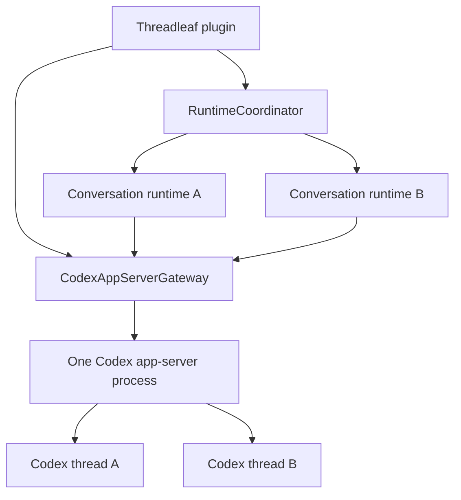

# Threadleaf architecture

Threadleaf separates page navigation, persisted conversations, task
coordination, and provider execution so page changes never own or cancel agent
work.

## Runtime ownership

The plugin owns one `CodexAppServerGateway` for the lifetime of the Vault
plugin instance. The gateway owns the child process, RPC transport, launch
configuration, and process generation.

Each conversation owns a lightweight `CodexChatRuntime`. It retains
conversation-specific thread, turn, prompt, approval, and stream state, but
does not own a child process.

The gateway broadcasts notifications to active conversation runtimes. Each
runtime accepts only notifications matching its current `threadId` and
`turnId`. Server-initiated requests are dispatched to exactly one runtime by
`threadId`.

## Lifecycle invariants

- Persisted conversation count does not determine child-process count.
- Page navigation changes the visible route but does not dispose a running
  conversation runtime.
- Plugin unload first cancels conversation work, then shuts down the shared
  gateway.
- A gateway restart increments its generation. Every conversation runtime
  observes that generation and resumes its persisted Codex thread in the new
  app-server process before starting another turn.
- Conversation runtime cleanup removes its gateway subscriptions without
  shutting down the shared process.

## Current boundaries

- `src/page-context`: active page detection and page-to-conversation routing.
- `src/conversations`: persisted conversation content and provider session
  metadata.
- `src/runtime`: provider-neutral task coordination and background status.
- `src/providers/codex/runtime`: Codex protocol, shared process gateway, and
  per-conversation runtime state.
- `src/ui`: Obsidian presentation and user interaction.

Future storage and UI work should preserve these ownership boundaries.
